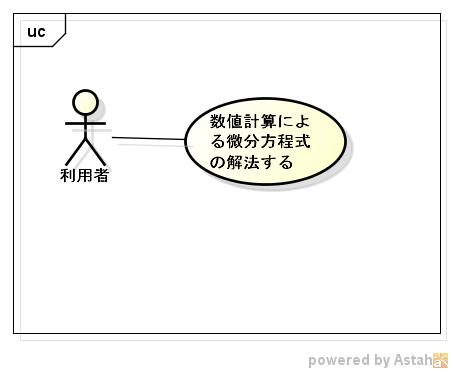

num4different
=============
数値計算による微分方程式を解くFFI

## decscription ##

詳細は、https://siranovel.github.io/mydocs/num4different  

## Demo ##

## VS. ##

## Requirement ##
ruby FFIライブラリ

## Usage ##

## install ##

From rubygems:　　
~~~
    [sudo] gem install num4diff
~~~
or from the git repository on github:  
~~~
    git clone https://github.com/siranovel/num4different.git  
    cd num4different  
    make -C ext/num4different
    jruby -S gem build num4diff.gemspec
    jruby -S gem install num4diff
~~~

## Contribution ##

## Licence ##
[MIT](LICENSE)

## Author ##

[siranovel](https://github.com/siranovel)
